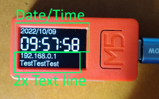
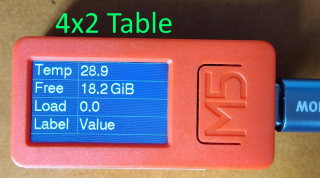
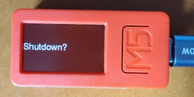

# M5stickC plusを用いた簡易表示機

m5stickC plusを，ラズパイ等の画面を持たないマイコンの簡易的な表示器として使うためのプログラム．


シリアルポートを経由して，シェルスクリプトでも作れるような極簡単なコマンドで表示内容を設定できる．また，m5stickのボタンが押されると，イベントとして通知される．シリアルポートの設定は115200bps．

画面は，時計画面，表画面，シャットダウン画面の3つで，Bボタンで切り替える．

時計画面では，タイムゾーンの概念は無いので，表示を行いたいローカルタイムでやりとりを行うこと．

## アクセス権の設定

Linuxで利用する場合，M5Stickを接続するとttyUSB*として見える．このデバイスに対してRWのアクセス権があることが必要．
デフォルトではdialoutグループにRW権限が付くので，操作をするUIDをdialoutグループに追加しておく．もしくは，udevのスクリプトを作成し，無条件にRWを許可する．
例えば，/etc/udev/rules.d に，99-m5stack.rules というファイルを以下の内容で作成しておく．
```txt
KERNEL=="ttyUSB*", SUBSYSTEMS=="usb", ACTION=="add", ATTRS{idProduct}=="6001", ATTRS{idVendor}=="0403", MODE="0666"
```

## 時計画面

時計画面には，現在の日付と時刻が表示される．また，時刻の下に2行，汎用の文字列表示のエリアが確保されており，任意の文字列を表示できる．



## 表画面

4行2列の表になっている画面で，ラベルと文字列を設定するとそれが表示される．



## シャットダウン画面

Shutdown? と表示されるだけでの画面．この画面が出ている状態でAボタンを押すと，ホストに'$b2A' という文字列が渡るので，ホストはそれを受け取ったら実際にシャットダウンなりなんなりの動作をするようにすると良い．




## やりとりするコマンドの形式

```$Xyyyyy<CR><LF>```

の形．
行頭は必ず$で始まり，コマンドはアルファベット1文字．その後にパラメータが続く．改行コードはCRLF．1行は最大32文字．

例えば，
```txt
stty -F /dev/ttyUSB0 115200
echo "\$t0HogeHoge" > /dev/ttyUSB0
```
とすれば，時計画面の時刻の下に"HogeHoge"と表示される．

## イベントの通知

M5Stickのボタンが押されるとイベントとして通知される．

```$bXY<CR><LF>```

X: 現在表示している画面番号．0,1,2のどれか．0が時計画面，1が表画面，2がシャットダウン画面．
Y: 押されたボタンの種類．Aボタンが押されたら'A'，Bボタンが押されたら'B'になる．

例：```$b0A<CR><LF>``` 画面0を表示している状態でAボタンが押された．


## 各コマンドの説明

### バージョン情報の取得

|方向|文字列|説明|
|--- |---- |--- |
|送信|$V   |     |
|受信|$Vstickdisp x.y.z| 固定文字列'stickdisp' とバージョン情報|


### 現在のRTCの値の読み出し

|方向|文字列|説明|
|--- |---- |--- |
|送信|$r   |     |
|受信|$rYYYYMMDDhhmmss| 現在時刻|

RTCを読み出した値をすぐに返答する．

### 現在のRTCの値の読み出し

|方向|文字列|説明|
|--- |---- |--- |
|送信|$R   |     |
|受信|$RYYYYMMDDhhmmss| 現在時刻|

RTCの秒の単位が変化するまで待ってからRTCの読み出し結果を返す．このため，最大1秒の待ちが発生しうるが，返答を得たタイミングが正秒になっているため誤差が小さい．

### RTCに値をセットする

|方向|文字列|説明|
|--- |---- |--- |
|送信|$wYYYYMMDDhhmmss   |     |

### 時計の文字色を設定する

|方向|文字列|説明|
|--- |---- |--- |
|送信|$cRGB | RGBは0-fの値．fffで白，f00で赤． |


### 時刻表示ページに表示する文字列を設定する

|方向|文字列|説明|
|--- |---- |--- |
|送信|$txStr   | xが行．0 or 1，その後に文字列が続く  |

例： $t0HogeHoge

### LEDのOn/Offを行う

|方向|文字列|説明|
|--- |---- |--- |
|送信|$lx | xを0にすると消灯，1にする点灯|


### 表示画面の切り替え

|方向|文字列|説明|
|--- |---- |--- |
|送信|$sx |xは0,1,2で，0:時計, 1:テーブル, 2:シャットダウン|


### テーブルの内容を設定する

|方向|文字列|説明|
|--- |---- |--- |
|送信|$vrcs |r:行，c:列0,1 s:文字列|

例： ```$v01HogeHoge<CR><LF>```

### M5Stickの電源を切る

|方向|文字列|説明|
|--- |---- |--- |
|送信|$p | |

